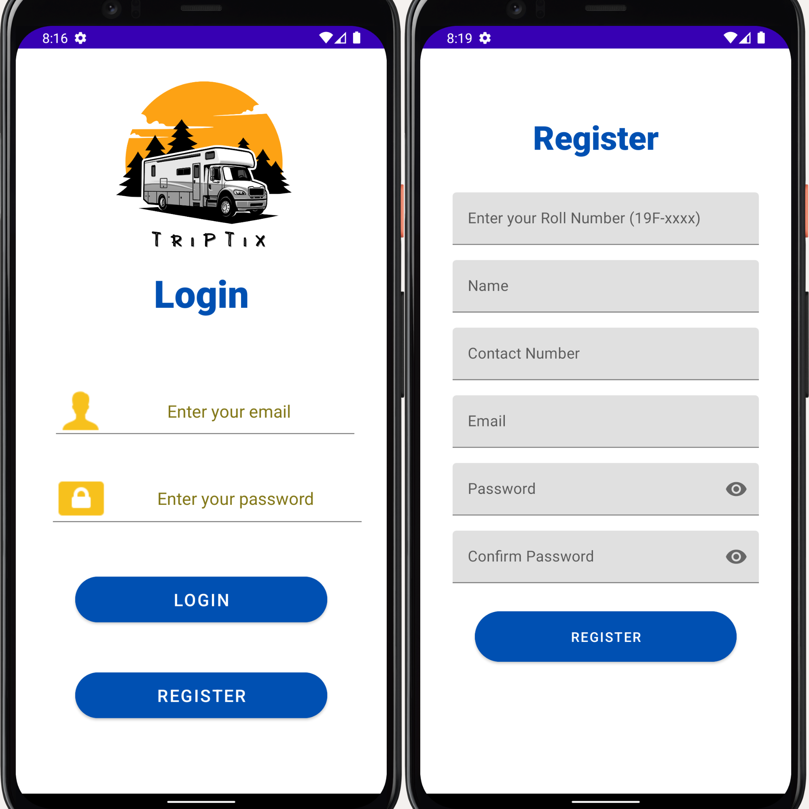
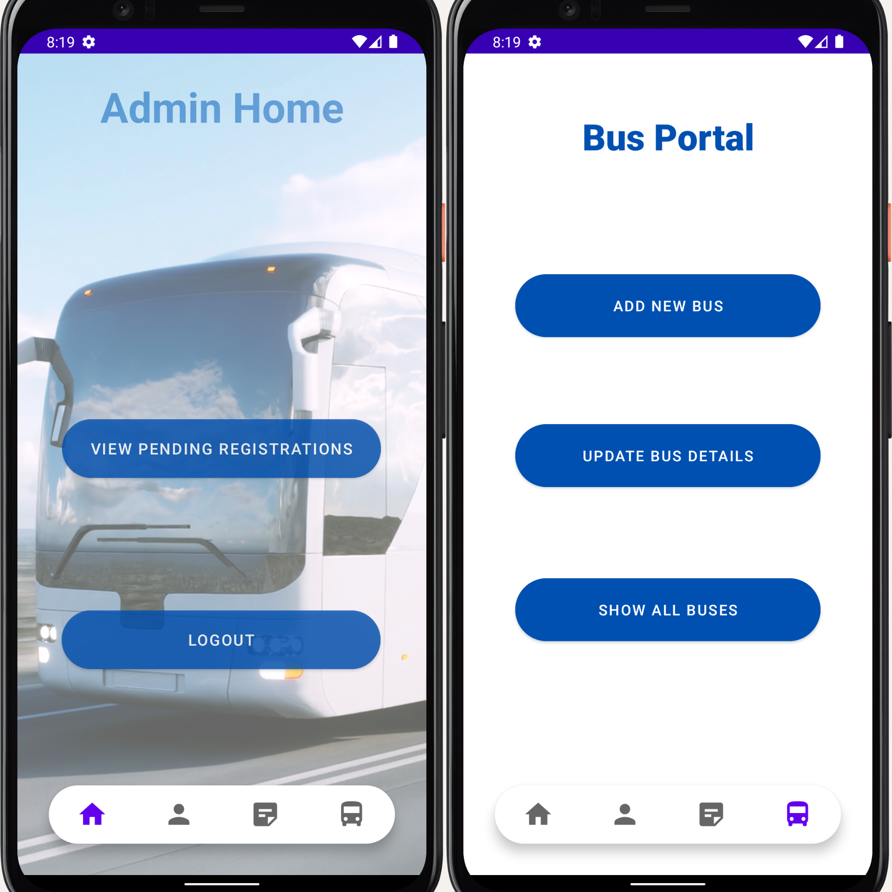
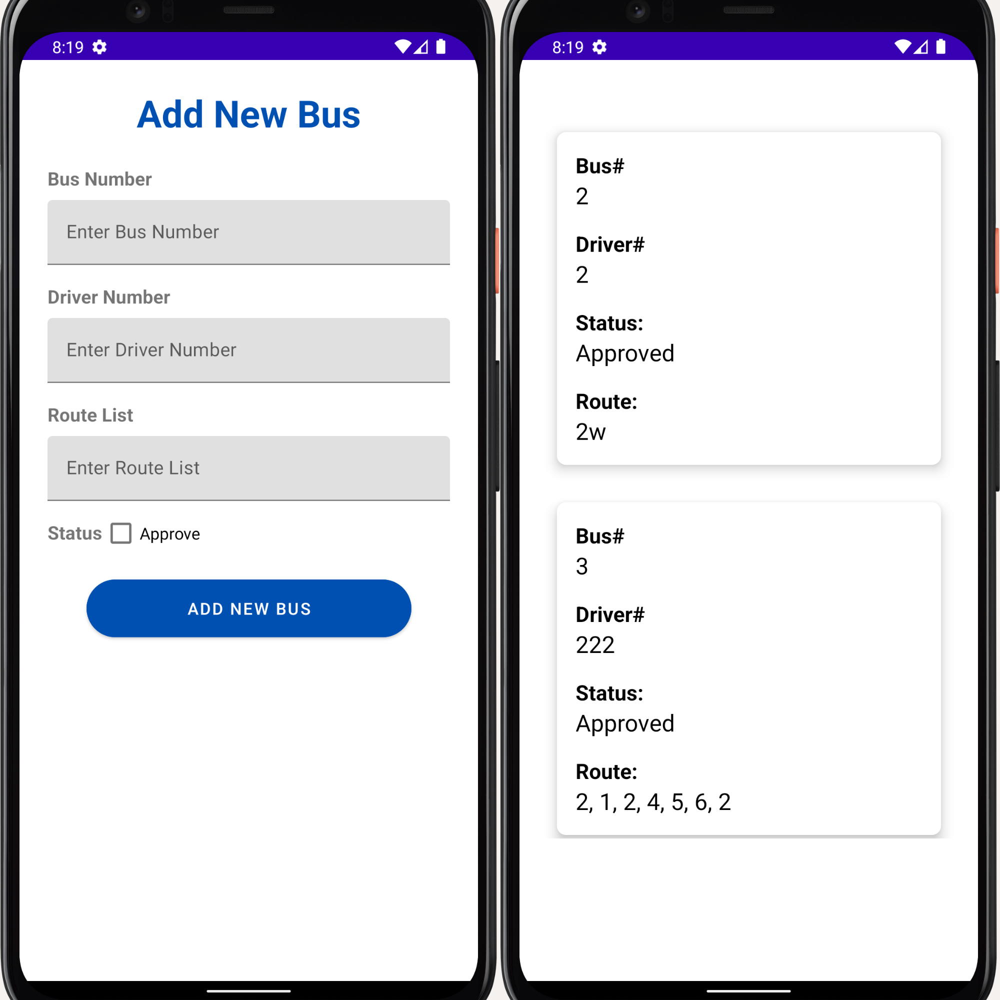
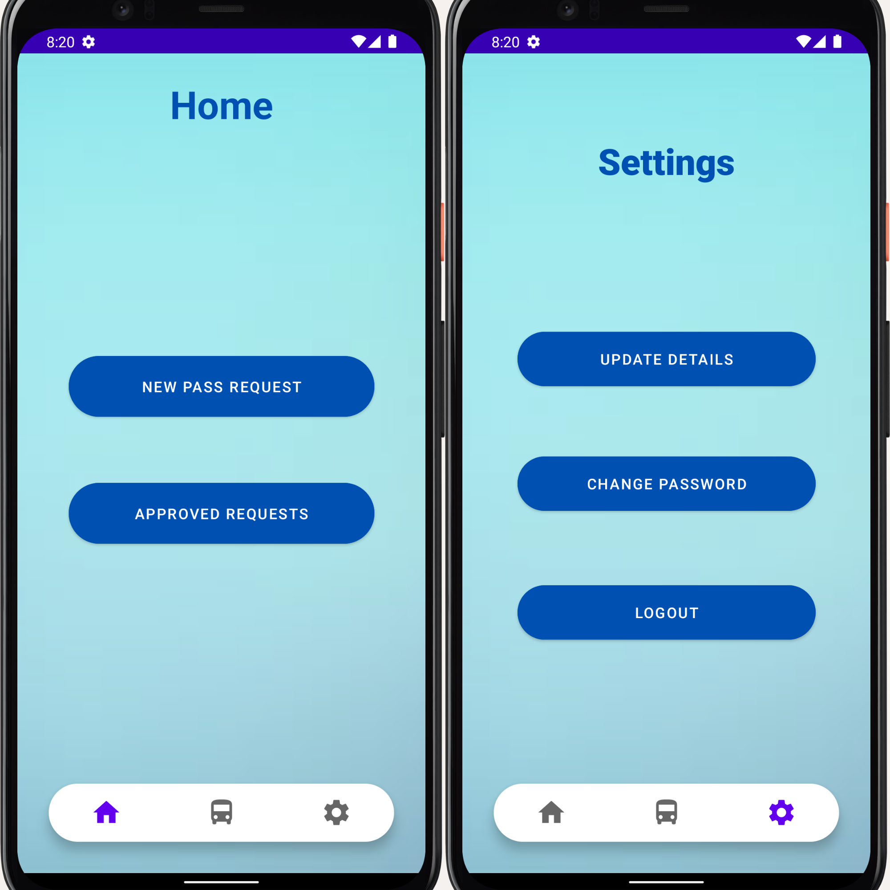

# Bus Pass Management System

The Bus Pass Management System is a comprehensive tool designed to streamline the process of bus pass handling for schools and colleges. It offers a dual-dashboard system for both administrators and clients (students), focusing on seamless registration, authentication, account management, QR code allocation, and notification handling.

## Introduction

The modern education environment often requires extensive travel for students. Traditional methods of managing bus passes have been found to be time-consuming, prone to errors, and challenging to scale. The Bus Pass Management System aims to rectify these issues by providing an automated, user-friendly platform that takes care of the complete lifecycle of a student's bus pass.

## Modules

### Registration Process

New users can easily register for the bus pass system through a simple, intuitive interface. The process asks for essential details including name, student ID, contact information, and bus route information. The data captured in this process is stored securely and used to manage the user's account effectively.

### Authentications

The system ensures only authorized individuals have access to their respective accounts, providing a secure environment for managing bus passes. The authentication module uses state-of-the-art security measures to verify user credentials and protect against unauthorized access.

### Accounts Handling

Each registered student has an account where they can manage their details, view the status of their bus pass, update their bus routes, and renew their passes when necessary. Administrators have access to a centralized dashboard for managing user accounts.

### Assigning QR Codes

To streamline the verification process, each eligible student is assigned a unique QR code. This QR code is tied to their account and can be scanned by the bus conductor using a mobile device to verify the pass. This reduces the need for physical passes, enabling a contactless and efficient process.

### Notification Handling

The notification module ensures students are informed of important updates and changes related to their bus pass. This includes renewal reminders, bus schedule changes, or any system updates. Notifications can be managed and customized within the user's account settings.

This Bus Pass Management System aims to bring bus pass management into the digital age, making it easier and more efficient for everyone involved.

# Demo Screenshots

